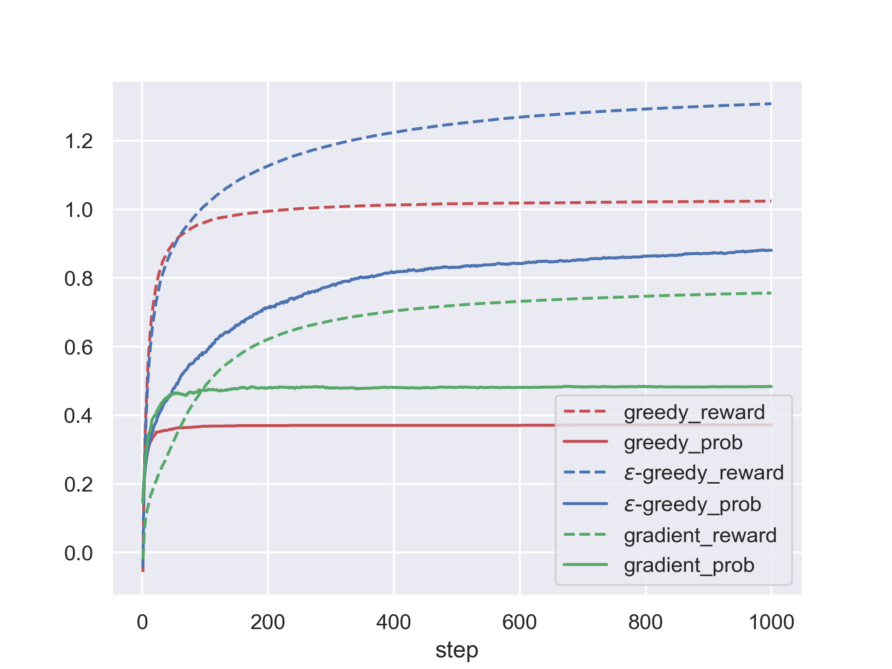

# RLexp
The is the code for the **Experiments of Reinforcement Learning**, which will be mainly written by C++ and Python.

## Reinforcement Learning codes

* **Ex1** classic n-bandit problems
	- This problem contains a bandit with n arms, each generate a normal distribution reward.
	- Three policies will be implemented: i.e. *Greedy Policy*, *ε-Greedy Policy*, *Gradient Policy*.
	- Simulation results will be displayed by Python.
	- Some basic results can be viewed as follows
          
	- It can be seen that *ε-Greedy Policy* is apprently better than *Greedy Policy*

* **Ex2** gridworld for finite markov decision process
	- This problem contains a n x n gridworld, with some of the location has given positive rewards, while out of the gridworld with a negative reward. While we want to find a optimal value function, we shall have the following formula according to Bellman's equation. Therefore, this problem can be solved with dynamic programming (DP) with an iterative process.
	$$v_*\left(s\right) = \max_a \sum_{s',r} p\left(s',r|s,a\right)\left(r+\gamma \cdot v_*(s')\right)$$
	- We will first initialize the gridworld with zero values, and then iterate the gridworld until the board converge. Thus we could get the value of each grid. By choosing the optimal value in the grid, we can get an optimal path.